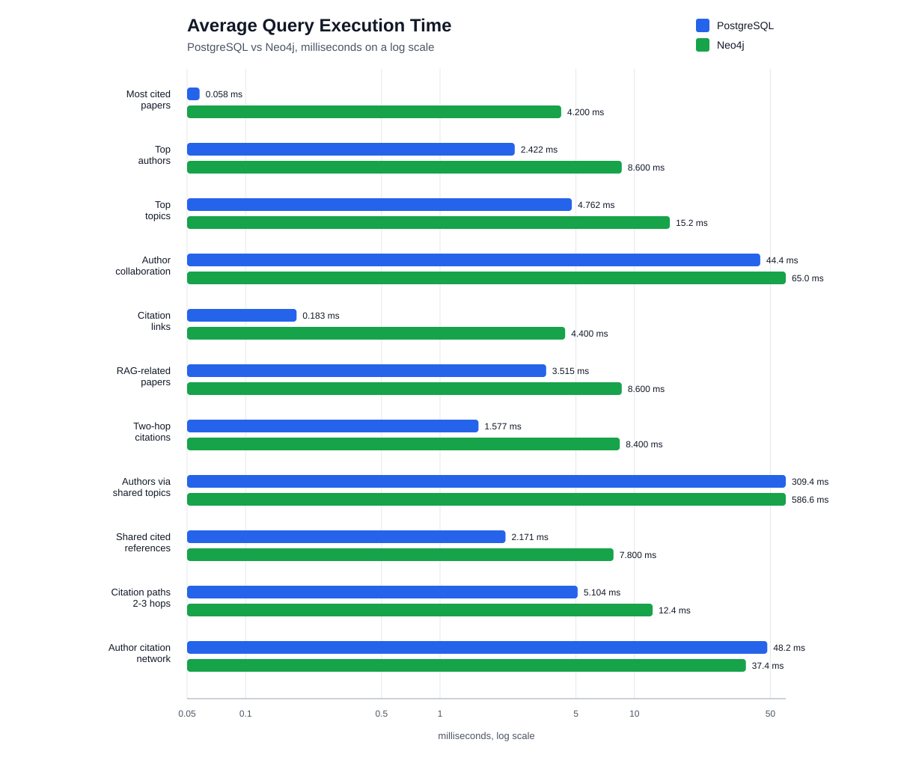
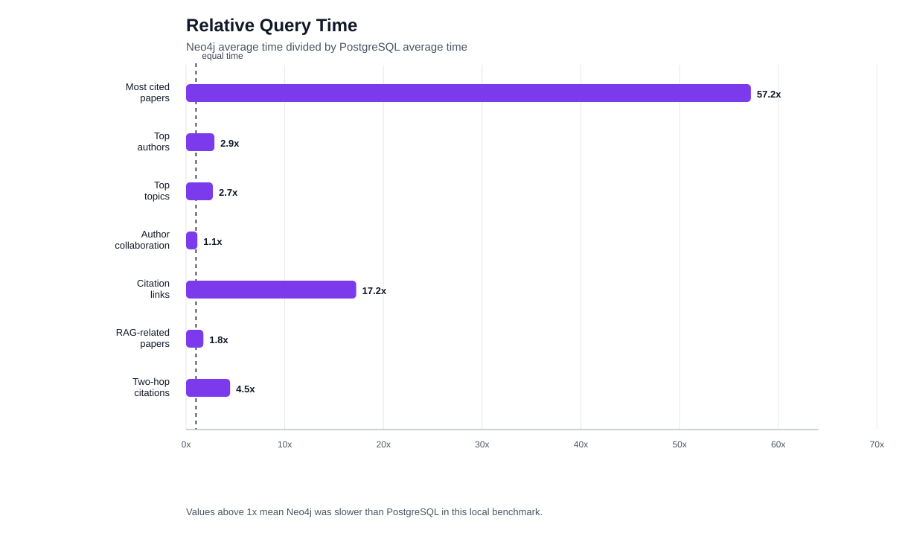

# Benchmark Results

Generated at: 2026-05-14 21:22:23

## Methodology

- Warmup runs per query/system: 1
- Measured runs per query/system: 5
- PostgreSQL timing uses `EXPLAIN (ANALYZE, FORMAT JSON)` and records server execution time.
- Neo4j timing uses `PROFILE` through `cypher-shell --format verbose` and records the reported result-ready plus result-consumption time.
- The dataset is the current generated OpenAlex subset loaded into both local Docker containers.

## Summary

| Query | PostgreSQL avg ms | Neo4j avg ms | Faster system | Notes |
|---|---:|---:|---|---|
| Most cited papers | 0.058 | 4.200 | PostgreSQL | Find the most cited papers in the selected OpenAlex subset. |
| Authors with the most papers | 2.422 | 8.600 | PostgreSQL | Count how many selected papers are connected to each author. |
| Most frequent topics | 4.762 | 15.200 | PostgreSQL | Count the most frequent topics in the selected paper subset. |
| Author collaboration pairs | 44.358 | 65.000 | PostgreSQL | Find author pairs that appear together on the largest number of selected papers. |
| Citation links inside the subset | 0.183 | 4.400 | PostgreSQL | Return citation relationships where both papers are present in the selected subset. |
| RAG-related papers | 3.515 | 8.600 | PostgreSQL | Search selected papers for Retrieval-Augmented Generation references in titles or abstracts. |
| Two-hop citation paths | 1.577 | 8.400 | PostgreSQL | Find paper pairs connected by a two-step citation path. |
| Authors connected through shared topics | 309.447 | 586.600 | PostgreSQL | Find author pairs whose papers share many OpenAlex topics. |
| Papers sharing cited references | 2.171 | 7.800 | PostgreSQL | Find paper pairs that cite the same papers inside the selected subset. |
| Citation paths up to three hops | 5.104 | 12.400 | PostgreSQL | Find paper pairs connected by citation paths of length two or three. |
| Author citation network | 48.214 | 37.400 | Neo4j | Find author pairs connected when one author's selected papers cite the other author's selected papers. |

## Detailed Statistics

| Query | System | Avg ms | Median ms | Min ms | Max ms |
|---|---|---:|---:|---:|---:|
| Most cited papers | PostgreSQL | 0.058 | 0.056 | 0.047 | 0.076 |
| Most cited papers | Neo4j | 4.200 | 3.000 | 2.000 | 9.000 |
| Authors with the most papers | PostgreSQL | 2.422 | 2.257 | 2.080 | 3.096 |
| Authors with the most papers | Neo4j | 8.600 | 7.000 | 6.000 | 15.000 |
| Most frequent topics | PostgreSQL | 4.762 | 4.269 | 3.643 | 6.174 |
| Most frequent topics | Neo4j | 15.200 | 12.000 | 10.000 | 29.000 |
| Author collaboration pairs | PostgreSQL | 44.358 | 42.086 | 38.561 | 57.535 |
| Author collaboration pairs | Neo4j | 65.000 | 64.000 | 48.000 | 83.000 |
| Citation links inside the subset | PostgreSQL | 0.183 | 0.197 | 0.136 | 0.213 |
| Citation links inside the subset | Neo4j | 4.400 | 3.000 | 3.000 | 10.000 |
| RAG-related papers | PostgreSQL | 3.515 | 3.327 | 2.828 | 4.510 |
| RAG-related papers | Neo4j | 8.600 | 6.000 | 5.000 | 18.000 |
| Two-hop citation paths | PostgreSQL | 1.577 | 1.699 | 1.218 | 2.021 |
| Two-hop citation paths | Neo4j | 8.400 | 7.000 | 5.000 | 16.000 |
| Authors connected through shared topics | PostgreSQL | 309.447 | 301.915 | 285.593 | 355.952 |
| Authors connected through shared topics | Neo4j | 586.600 | 578.000 | 530.000 | 670.000 |
| Papers sharing cited references | PostgreSQL | 2.171 | 2.086 | 1.699 | 2.834 |
| Papers sharing cited references | Neo4j | 7.800 | 8.000 | 7.000 | 8.000 |
| Citation paths up to three hops | PostgreSQL | 5.104 | 5.757 | 4.037 | 5.806 |
| Citation paths up to three hops | Neo4j | 12.400 | 13.000 | 8.000 | 16.000 |
| Author citation network | PostgreSQL | 48.214 | 47.688 | 44.803 | 52.426 |
| Author citation network | Neo4j | 37.400 | 36.000 | 35.000 | 40.000 |

## Execution Diagnostics

| Query | PostgreSQL avg planning ms | Neo4j database accesses | Operator-level note |
|---|---:|---:|---|
| Most cited papers | 0.468 | 629 | Ranking query; PostgreSQL handles sort/limit cheaply on the small table. |
| Authors with the most papers | 0.758 | 13822 | Join plus grouping; Neo4j expands author-paper relationships before aggregation. |
| Most frequent topics | 1.317 | 20221 | Join plus grouping over paper-topic relationships. |
| Author collaboration pairs | 1.615 | 64054 | Self-join/pattern expansion over shared papers. |
| Citation links inside the subset | 1.155 | 134 | Simple relationship lookup; PostgreSQL is extremely fast on the small citation table. |
| RAG-related papers | 0.587 | 918 | Text filter over title/abstract; no full-text/vector index was added. |
| Two-hop citation paths | 1.835 | 19008 | Two-step citation traversal; PostgreSQL still wins on this small citation graph. |
| Authors connected through shared topics | 25.594 | 1845747 | Large expansion over author/topic combinations; expensive in both systems. |
| Papers sharing cited references | 1.777 | 21815 | Self-join/pattern over shared citation targets. |
| Citation paths up to three hops | 1.054 | 4830 | Recursive/path-like query; Neo4j traversal is expressive but not faster here. |
| Author citation network | 3.345 | 40740 | Natural author-paper-citation-author path; Neo4j is faster in this measured query. |

## Interpretation Notes

These results should be interpreted as a local project benchmark, not as a universal ranking of PostgreSQL and Neo4j.
The dataset is intentionally small, and query performance depends on data size, indexing, cache state, query shape, and hardware.
The most useful project conclusion is not only which system is faster, but also which query is simpler and more natural to express.

A supplemental graph-focused workload is available in `docs/graph_focused_benchmark_results.md`.
That extra workload keeps the original benchmark unchanged, but adds graph-shaped queries involving anchored neighborhoods, two-hop author citation paths, and citation relationships constrained by shared topics.
In the supplemental workload, Neo4j wins two additional network-style queries.
